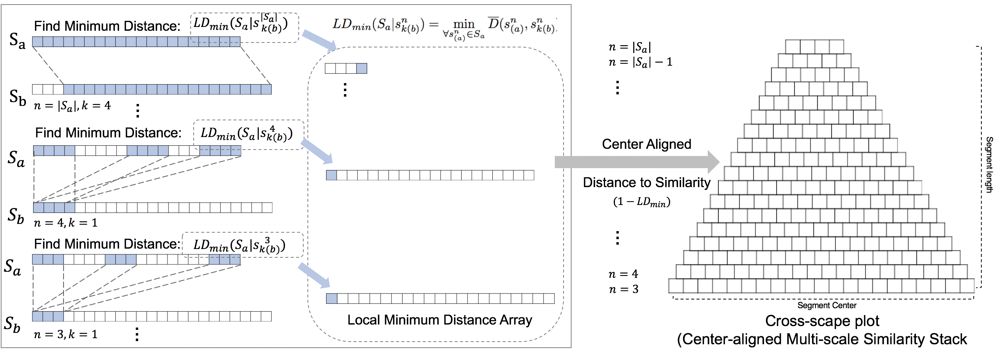
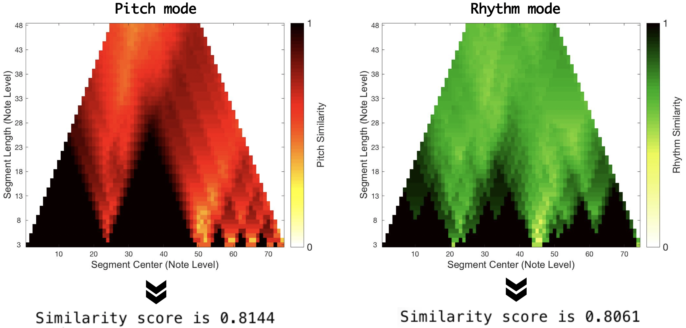

# Cross-Scape Plot Representation

Matlab implementation of "[A Cross-Scape Plot Representation for Visualizing Symbolic Melodic Similarity](http://archives.ismir.net/ismir2019/paper/000050.pdf), ISMIR 2019".


 
The cross-scape plot is computed by stacking up a minimum local distance between segments from each of the two songs. After segmenting the songs, the local similarity is performed by a sequence-based similarity algorithm for all possible segments of the two songs. As the layer goes up, the segment size increases and it computes progressively more long-term distances. It is described by a hierarchical visual representation with a triangular or trapezoidal shape.

## Usage

1. Load midi files to be compared. (by [MIDI toolbox 1.1](https://github.com/saebyulpark/cross_scapeplot_visualization/tree/650eabf9ceef7527c18088983de8407758d4d7c0/1.1-master2))
```
song_a = readmidi(midi_file_path1)
song_b = readmidi(midi_file_path2)
```

2. Caculate distance matrix between two songs.
```
dist_mat = get_distance_matrix(song_a, song_b, pitch_or_rhythm) % picth = 1, rhythm = 2
```

3. Caculate similarity score from distance matrix.
```
score = get_similarity_score(dist_mat)
```

## Result


An example of a cross-scape plot. The local similarity is indicated by color (pitch: red, rhythm: green). The x-axis shows the location of the longer melody. The y-axis represents the segment size.

## References
This sample case is one of the plagiarism cases (Mood Music v. De Wolfe) and the following links provide resources for this case.
 - https://blogs.law.gwu.edu/mcir/case/mood-music-v-de-wolfe/
 - https://www.lostinmusic.org/Cases/Detail/3-mood-music-vs-de-wolfe-music#tab_evidence
